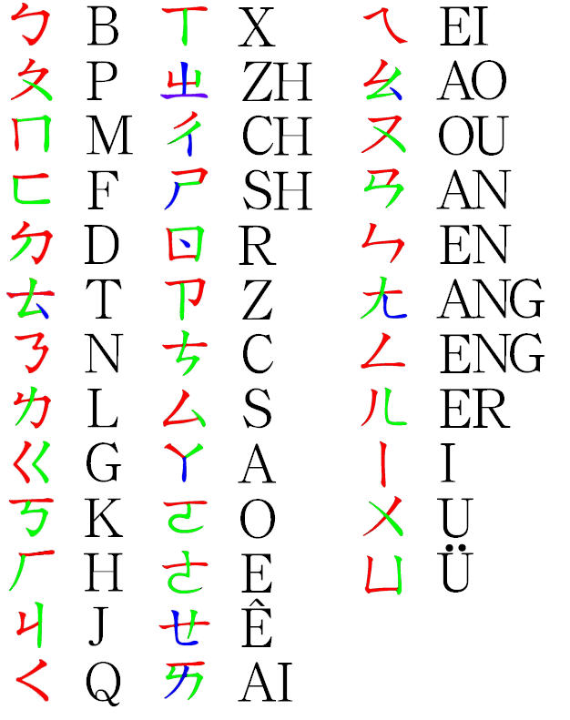

**罗马化（英语：Romanization），又称拉丁化（Latinization），是语言学中将不是拉丁字母（又称罗马字母）形式的文字系统，转换成拉丁字母的过程。**主要是将被转换系统里的非拉丁文字，按照转写系统的规则和转写表，忠实地将字符（也包括字符的附加符号及单音素双字符）对号入座地转写成转换系统里的拉丁字符。被转换系统与转换系统的字符也可以逆向转写。

**除了拼音文字之外，现今唯一彻底采用语素文字系统的汉字也从近代起出现罗马化方案，但并未完全取代汉字原有的功能。**

类似罗马化的文字转写型式还有“西里尔化”（又称“斯拉夫化”），即把一个语言音译或转录成西里尔字母的过程。

以上来自https://zh.wikipedia.org/zh-cn/罗马化

空下来再系统地大体上学一学语言学。

