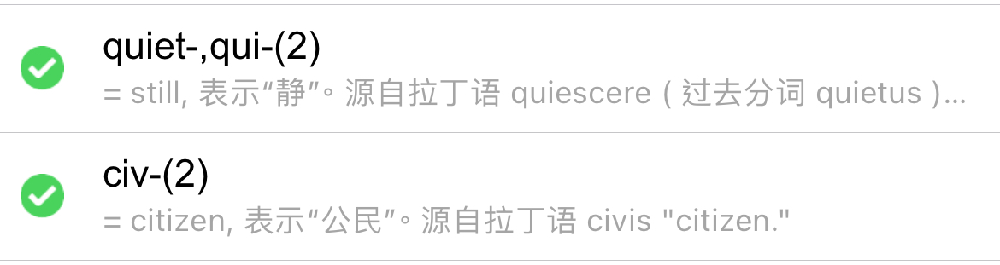

scramble trample

  

- war-: watch注视
    - wary直球名词，谨慎的小心的
        - vs. prudent vs. discreet
- lic-, lac-: 诱惑；套索
    - delicate虚弱易碎的；美味精致柔和的
- rend-: give
    - render
        - redering
    - rendition
    - surrender
    - rent