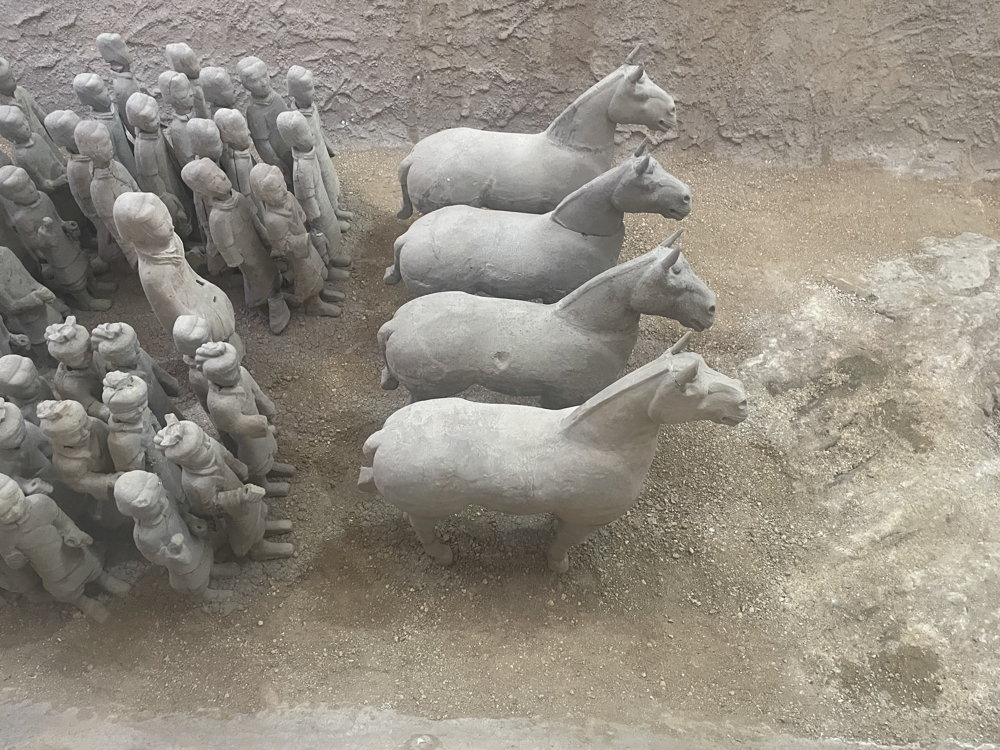

4月4號到昨天9號一共六天沒背單詞。

把之前贴过的图都改了下大小——
`!\[(.*)\]\((.*)\)`
``

在外面玩了三天后睡了两天，一直到10号今天。

- 徐州之行
    
    - 绕着所谓汉文化景区转了一整圈，其实整个就是八九十年代才挖出来的楚王陵，里面有兵马俑，后面一个很多山上都有的寺庙，门口还有人唱歌，绿化得就像个公园，如果你意识到这其实是把人坟给刨了的话就有点怪
    - 太大了，只想看兵马俑的话就得来西边，从狮子山穿过来太远了。
     
    - 一路看到好多彭城，狮子山羊鬼山西北甚至有个彭城庙，最后在楚王陵看了本书才意识到是因为彭祖故乡所以徐州叫彭城。
    - 在徐州故黄河看着飘絮给奶奶打视频看风景，三年前也几乎就是这样一个夏初，我在重庆长江河畔给奶奶打视频看风景，奶奶问我爸知道了吗，我跟她说等回去再告诉爸，先瞒着别让他知道。
    - 结果没出三天，一切都没了。
    - 对徐州最大的印象：非机动车九成红灯行（高峰除外），另外共享电动车巨多，斑马线没车让人。
    - 狗肉味道远不如羊肉，也不如牛肉。
    - 油汪汪的东西在包里闷一晚上就馊了，可能因为沾了口水？狗腿没坏。吃了倒没坏肚子
- 安吉大麓
    - 老狼：保持理智。
    - 二手玫瑰的感染力很强，他的演出和舞台屏幕效果和人群氛围，共同构成了这种超强感染力。去迪厅已经够带劲了，当我处在人群中央（任怎么挤也挤不到前排），看着百倍于迪厅的人一起跟着节奏举着手跳跃，才能真切体会到什么叫人民的力量，因为我只不过是茫茫人群里一个攒动的人头，只能随着人群移动，所有人也都在默契移动。
- 薛之谦
    - 莲花奥体中心4万7千人；
    - “现场的男生，我知道你们不想来听我演唱会都是被女朋友拖来的。”
    - 就算没有人唱歌，只是五万人在春天雨夜默默坐在这个场馆里整齐变化灯光，甚至没有灯光只是黑着灯整齐坐着也很奇妙。
    - 灯光，脱口秀，伴舞，编排，舞台，猜下首歌像看春晚。
    - 一直问听过没，跪下叫衣食父母。态度
    - 高中时常听他的歌，

这个软件有些单词没有词根，所以背到1300就只能选择顺序/随机背剩下的200。